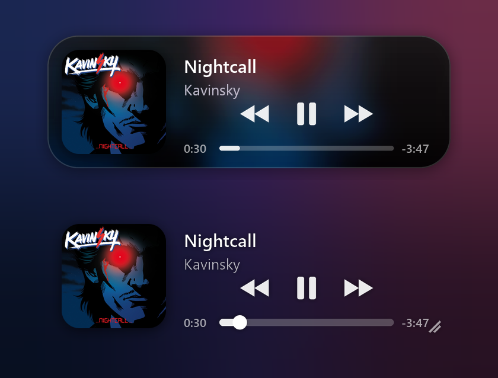

# Apple Music Widget

A see-through now-playing widget for **Apple Music on Windows**. It also keeps Apple Music running quietly in the system tray.



## Features

- **Two styles.** *Glass* is tinted by the album art and changes with every song. *Clear* sits directly on your wallpaper.
- **Controls.** Previous, play/pause, next, and a seek bar you can click or drag.
- **Apple Music in the tray.** Clicking Apple Music's **X** or minimising it hides it to the tray, and the music keeps playing. Shift+click the X to really quit.
- **Play from the widget.** If Apple Music is closed, pressing Play starts it hidden.
- **Resize.** Drag any edge or corner, hold Ctrl and scroll, or choose a size preset from the right-click menu.
- **No account needed.** No Apple login or API: it reads what's playing from Windows.

## Install

Requires Windows 11 and Python 3.14.

```
py -3.14 -m venv .venv
.venv\Scripts\python.exe -m pip install -r requirements.txt
run.cmd
```

Right-click the widget for settings, including **Start with Windows**.

## License

MIT
